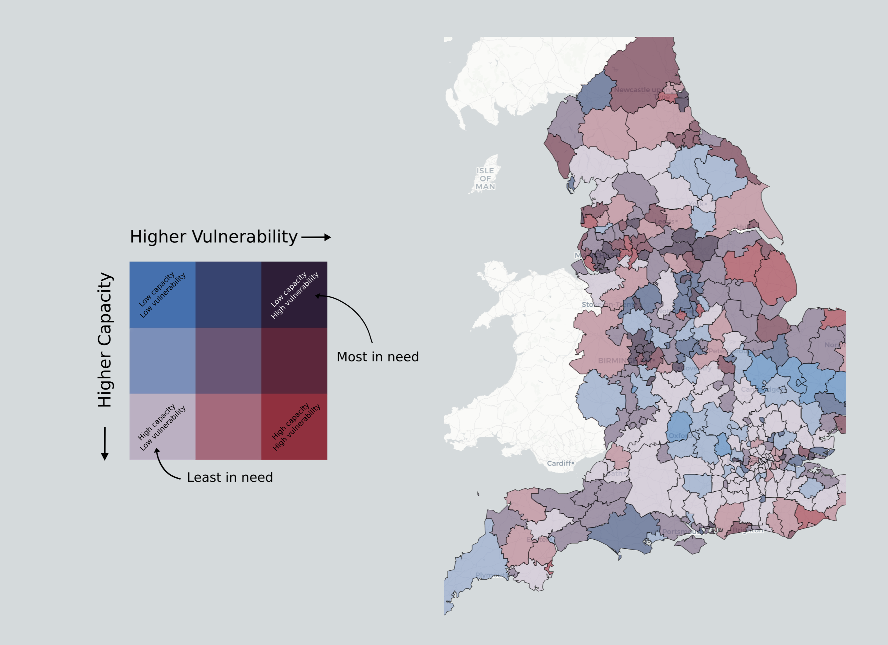
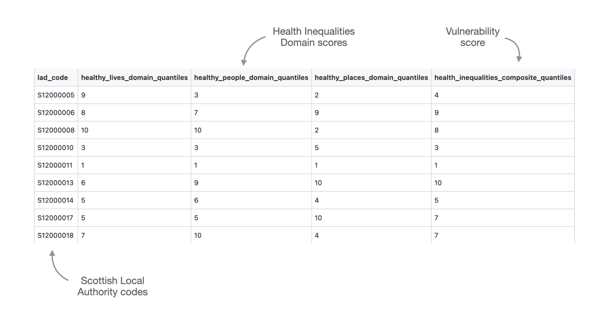
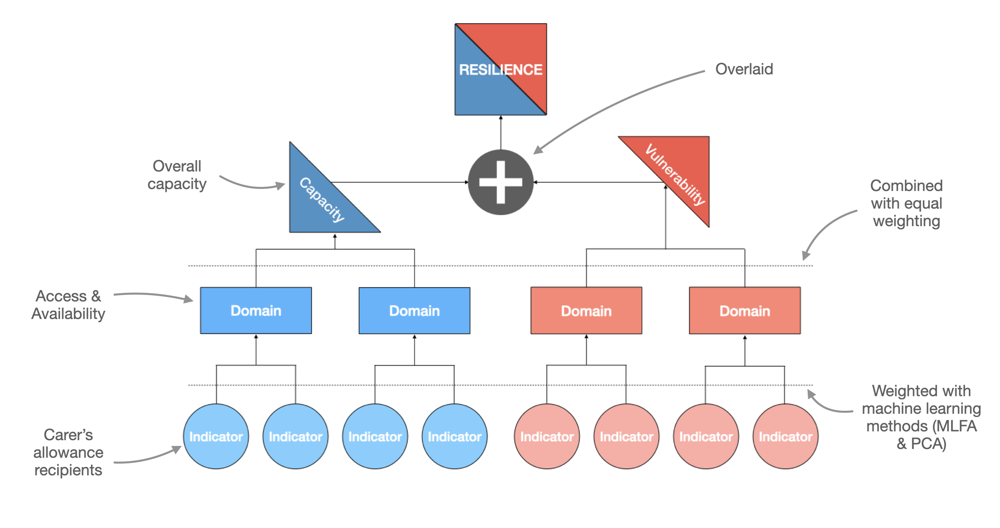

# Resilience Index </a>

 

## Overview

### What does it do?
The Resilience Index **maps** Local Authorities based on potential **need for support** (vulnerability) and **capacity** to meet that need.

### What is covered
There are **three** indices, one of each of the British Red Cross 2030 **Strategic Causes**: (1.) health inequalities; (2.) Disasters & Emergencies; (3.) Displacement & Migration.

### Where is covered?
The Resilience Index maps **Local Authorities** in each of the four devolved nations across the **UK**.

## Output (Maps)

- **Twelve** maps/scores in total. **Three** indices, across **four** nations.
- Each map is specific to a single cause and nation and presents a resilience score:

## Output (Tables)

- Data tables will also be available with indicator scores, domain scores, vulnerability & capacity scores, and overall resilience scores:

## Calculating Resilience

- **Indicators** are combined to **form domain**s, which are **then combined to** form capacity & vulnerability **scores**, which are then compared side-by-side to form a resilience score.

## FAQ

### Does the Resilience Index replace the COVID-19 Vulnerability Index?
No. The indices cover different needs. The COVID-19 VI is specific to
COVID-19 only.

### Can the indices of each nation be compared side by side?
No. They are designed to be viewed independently.

### Where can I find more info?
Long form documentation can be found at [here](https://docs.google.com/document/d/1amBSWFLcZpzLrhaYmXYIobXKnxaaLnpMiDochUTQlx8)

## Dev
The Resilience Index *closely* resembles an R package in structure. If you are new to R packages, the [R Packages](https://r-pkgs.org/) book is a good resource, and will help you understand how to navigate this repository. An R package structure was chosen as it is a well tested convention for organising code and related artefacts that comes with a bunch of free tools (e.g., dependency management via the `DESCRIPTION` file).

Unlike a typical R package, all the `.R` source files live within subdirectories of `R/` to make it easier to navigate through the files. Each dimension of the resilience index (capacity and resilience) is split by BRC strategic cause (disasters & emergencies, migration & displacement, and health inequalities) and devolved nation (eg. , `capacity/disasters-emergencies/england/`). For each of these subfolders, each of the indicators which make up the relevant component (specified in the path of the subfolder) should occupy a single file. These single files serve as the reproducible building-block for that component. The `data/` folder mirrors this structure. This makes both documenting and updating the indicators easier.

Old code that was written before this repository got refactored to an R package structure, can now be found in the `depreciated/` folder. This code will slowly get ported to the new format, and will no longer be supported in the long term.

## Status

- The Resilience Index is currently under active development, and only exists in a limited capacity at this time. Check the metadata files in `/R` to see the progress of each cause in each nation.

- Last update: 26.11.21
- Notes: complete segments are only provisional and are subject to change (e.g., indicator amendments and weighting)

| Nation | Strategic Cause | Vulnerability | Capacity | Shocks |
| --- | --- | --- | --- | --- |
| England | Health Inequalities | :heavy_check_mark: | :heavy_check_mark: | NA |
| England | Disasters & Emergencies | :keyboard: - Under development | :keyboard: - Under development | :heavy_check_mark: - Heat Hazards |
| Scotland | Health Inequalities | :heavy_check_mark: | :x: | NA |
| Scotland | Disasters & Emergencies | :heavy_check_mark: | :x: | :heavy_check_mark: - Heat Hazards |
| Wales | Health Inequalities | :keyboard: - Under development | :x: | NA |
| Wales | Disasters & Emergencies | :heavy_check_mark: | :x: | :x: |
| Northern Ireland | Health Inequalities | :heavy_check_mark: | :heavy_check_mark: | NA |
| Northern Ireland | Disasters & Emergencies | :heavy_check_mark: | :keyboard: - Under development | :heavy_check_mark: - Fires & Floods |

## Contributing

To contribute to this project, please follow [GitHub Flow](https://guides.github.com/introduction/flow/) when submitting changes.

> Please note that this project is released with a Contributor Code of Conduct. By participating in this project you agree to abide by its terms.

## Credits
Designed and developed by [Mike Page](https://github.com/MikeJohnPage), [Matt Thomas](https://twitter.com/matthewgthomas), Ellen Gordon, Freya Neason and [Aileen McDonald](https://github.com/aileenmcd) at the British Red Cross.

[Contains public sector information licensed under the Open Government Licence v3.0.](http://www.nationalarchives.gov.uk/doc/open-government-licence/version/3/)
