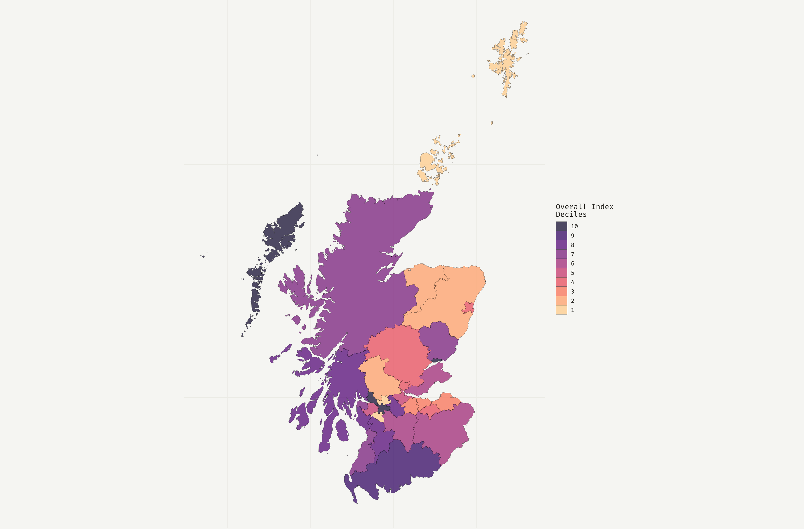

# Resilience Index </a>

 

## Overview
The Resilience Index maps Local Authorities based on potential need for support and capacity to meet that need. There are three different resilience indices, one for each of the British Red Cross strategic causes:

- Health Inequalities
- Disasters & Emergencies
- Displacement & Migration

## How to interpret the indices
Resilience is calculated as the interaction of need for support and capacity to cope. This is presented as an overall resillience score, which is then ranked and quantised (i.e., computed into quintiles and deciles):

## Development
The Resilience Index is currently under active development, and only exists in a limited capacity for England and Scotland, with the other devolved nations to be added at a later date.

## Structure
The Resilience Index *closely* resembles an R package in structure. If you are new to R packages, the [R Packages](https://r-pkgs.org/) book is a good resource, and will help you understand how to navigate this repository. An R package structure was chosen as it is a well tested convention for organising code and related artefacts that comes with a bunch of free tools (e.g., dependency management via the `DESCRIPTION` file).

Unlike a typical R package, all the `.R` source files live within subdirectories of `R/` to make it easier to navigate through the files. Each dimension of the resilience index (capacity and resilience) is split by BRC strategic cause (disasters & emergencies, migration & displacement, and health inequalities) and devolved nation (eg. , `capacity/disasters-emergencies/england/`). For each of these subfolders, each of the indicators which make up the relevant component (specified in the path of the subfolder) should occupy a single file. These single files serve as the reproducible building-block for that component. The `data/` folder mirrors this structure. This makes both documenting and updating the indicators easier.

Old code that was written before this repository got refactored to an R package structure, can now be found in the `depreciated/` folder. This code will slowly get ported to the new format, and will no longer be supported in the long term.

## Links
**Dashboard**:

- [R Shiny](https://britishredcross.shinyapps.io/resilience-index/) 

**Technical docs:**

- [Resilience Index](https://docs.google.com/document/d/1amBSWFLcZpzLrhaYmXYIobXKnxaaLnpMiDochUTQlx8)
- [Vulnerability Index](https://docs.google.com/document/d/1aWpzgvLKGEF5Ay_xVps17nnbT1zIEki7RGIIJXL5APo)

**Code:**

- [Model & data](https://github.com/britishredcrosssociety/resilience-index)
- [Dashboard](https://github.com/britishredcrosssociety/index-shiny-app)

## Contributing

To contribute to this project, please follow [GitHub Flow](https://guides.github.com/introduction/flow/) when submitting changes.

> Please note that this project is released with a Contributor Code of Conduct. By participating in this project you agree to abide by its terms.

## Credits
Designed and developed by [Matt Thomas](https://twitter.com/matthewgthomas), Ellen Gordon, Freya Neason and [Mike Page](https://github.com/MikeJohnPage) at the British Red Cross.

[Contains public sector information licensed under the Open Government Licence v3.0.](http://www.nationalarchives.gov.uk/doc/open-government-licence/version/3/)
